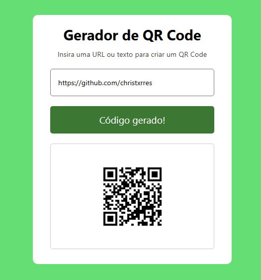

# 📱 Gerador de QR Code

Aplicação web desenvolvida com HTML, CSS e JavaScript que gera QR Codes dinamicamente a partir de um texto ou URL informados pelo usuário.

O projeto consome uma API externa para geração da imagem e aplica manipulação de DOM para atualizar a interface em tempo real.

## 📸 Preview 

## 🚀 Demonstração

🔗 Acesse no Vercel: *[Link](https://gerador-de-qrcode.vercel.app/)*

## 🛠️ Tecnologias utilizadas

- HTML5
- CSS3
- JavaScript (Vanilla JS)
- API pública de geração de QR Code

API utilizada: https://quickchart.io/documentation/qr-codes/

## 📄 Funcionalidades

- Geração dinâmica de QR Code a partir de texto ou URL
- Consumo de API externa via URL parametrizada
- Feedback visual durante a geração do código
- Expansão dinâmica do container após carregamento da imagem
- Geração ao clicar no botão ou pressionar Enter
- Reset automático ao limpar o campo de entrada
- Transições suaves com CSS

## 🎯 Conceitos aplicados

- Manipulação de DOM
- Eventos (click, keydown, keyup)
- Atualização dinâmica de atributos (src)
- Uso de template strings
- Controle de estado com classes CSS
- Escuta do evento load da imagem
- Separação de responsabilidades (HTML / CSS / JS)

## ⚠️ Observação

Este projeto utiliza uma API pública gratuita para gerar os QR Codes.
Não há armazenamento de dados ou backend próprio.

## 👤 Autor

Desenvolvido por **Christofer Torres**  
Projeto criado para fins de estudo e **portfólio front-end**.
